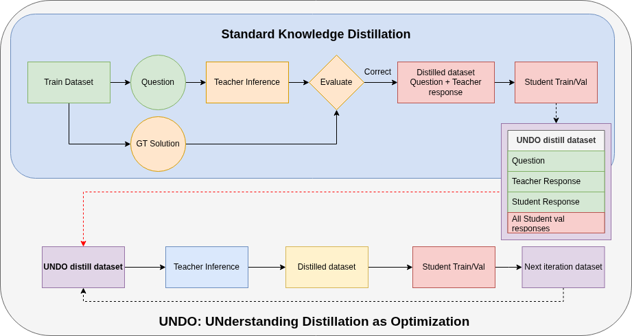

# INTERACTIVE DISTILLATION VIA UNDO METHOD


This project implements and extends the [UNDO framework](https://arxiv.org/pdf/2504.02521), which introduces **interactive knowledge distillation** as an iterative optimization process.
Instead of relying on a one-shot teacher–student transfer, UNDO repeatedly:

1. Distills knowledge from the teacher,
2. Evaluates the student,
3. Identifies student errors,
4. Regenerates refined teacher rationales conditioned on those errors,
5. Retrains the student with improved *teacher-distilled datasets*.

This feedback loop makes the student model learn more efficiently and adaptively, particularly for challenging **mathematical and reasoning tasks**.

Our implementation follows two goals:

1. **Validate** whether UNDO works as described in the paper.
2. **Enhance** UNDO with practical improvements (better prompts, tooling, and efficiency).



---

##  Updates
* **2025/10/16** – We use **easydistill** for Standard Knowledge Distillation for comparing with UNDO method.
* **2025/10/16** – Distillation by UNDO method have finished, result showed below.
* **2025/09/25** – Student evaluation results for Iteration 2 are in! See **Student Evaluation Results** section.
* **2025/09/17** – Student finetuning code is working, student now being finetuned
* **2025/09/11** – Released initial [student test code](src/student.py); see **Running** for usage. Student finetuning code is in progress.
* **2025/09/10** – All test datasets prepared; details in **Datasets** section.
* **2025/09/08** – Teacher model **QWEN3-30B-A3B** finished generating the first distilled dataset (10k samples, ~160 GPU hours).
* **2025/09/02** – New teacher prompt for higher-quality rationales ([code](src/prompt/teacher_prompt.py))

---

## Progress Checklist

| Status | Task                                    |
| ------ | --------------------------------------- |
| ✔️     | Prepare training dataset                |
| ✔️     | Implement teacher model |
| ✔️     | Evaluation method for teacher responses |
| ✔️      | Implement student model                 |
| ✔️     | Prepare test datasets                |
| ✔️      | UNDO iteration 1 updated!        |
| ✔️      | UNDO iteration 2 updated!      |
| ✔️      | UNDO iteration 3 updated!         |
| ✔️      | UNDO iteration 4 updated!          |
| ✔️      | Standard Knowledge Distillation DONE!   |
| ⬜      | ...         |


---
## Student Evaluation Results by UNDO Method


---


**Iteration 0 = base model without finetuning**

*: Datasets have been modified to match our evaluation format (final answer in `$\boxed{...}$`).

**: MLU_PRO math subset only.

##  Datasets

| Name                              | Type               | Link                                                                             | # Samples |
| --------------------------------- | ------------------ | -------------------------------------------------------------------------------- | --------- |
| NuminaMath-CoT-10k                | Train              | [HF](https://huggingface.co/datasets/MinTR-KIEU/NuminaMath-CoT-10k)            | 10,000    |
| NuminaMath-CoT-100k               | Train              | [HF](https://huggingface.co/datasets/MinTR-KIEU/NuminaMath-CoT-100k)           | 100,000   |
| Math500                           | Test               | [HF](https://huggingface.co/datasets/HuggingFaceH4/MATH-500)                   | 500       |
| GSM8K                             | Test               | [HF](https://huggingface.co/datasets/MinTR-KIEU/Test_gsm8k_boxed)              | 1,300     |
| MMLU PRO                          | Test               | [HF](https://huggingface.co/datasets/MinTR-KIEU/Test_MMLU_Pro_math_boxed)      | 1,350     |
| SVAMP                             | Test               | [HF](https://huggingface.co/datasets/MinTR-KIEU/Test_SVAMP_boxed)              | 300       |

---


## 💻 GPU Usage

| Model         | Recommended VRAM | Current Setup               | Platform | Notes                            |
| ------------- | ---------------- | --------------------------- | -------- | -------------------------------- |
| QWEN3-30B-A3B | 64 GB            | 6× RTX 5060 Ti (16 GB)     | GPU2     | \~4× RTX 3090 (24 GB) equivalent |
| QWEN2.5 1.5B  | 8 GB           | 1× RTX 3090 Ti (24 GB)      | GPU2  | Eval Mode              |
| QWEN2.5 1.5B  | 24 GB           | 2x RTX 3090 Ti (24 GB)      | GPU2  | Train Mode              |
---

## ⚙️ Installation

See [doc/installation.md](doc/installation.md) for detailed setup instructions.

---

## 🚀 Running UNDO method
**NOTE**: This currently messy because now build and test code phase, later will use .sh files to run the experiments.

### Teacher Inference

Set your Hugging Face token first:

```bash
export HF_TOKEN="your_huggingface_token"
```

Run teacher inference to generate a **teacher-distilled dataset**:

```bash
python src/teacher.py \
    --dataset NUMINA_10K_or_100K \
    --iter ITERATION_ID \
    --output output.jsonl \
    --hf_repo MinTR-KIEU/Teacher_CoT_NuminaMath_10k_I0 \
    --hf_private 0 \
    --push_every_min 0
```

Parameters:

* `--dataset` : Choose between `10k` or `100k`.
* `--iter` : `0` = first distillation, `1` = second, etc.
* `--output` : Local output file.
* `--hf_repo` : Hugging Face repo for dataset.
* `--hf_private` : 0 = public, 1 = private.
* `--push_every_min` : Auto-push interval (0 = disabled).


### Student Training
Fine-tune the student model on a Hugging Face dataset that contains `problem`, `teacher_solution`, and `gt` fields:


```bash
python src/student.py \
--mode train \
--dataset MinTR_KIEU/NuminaMath-CoT-10k \
--output runs/student_train_preds.jsonl \
--hf_repo your-username/undo-student-outputs \
--hf_path_in_repo data/student_train_preds.jsonl \
--push_every_min 30 \
--hf_private 1 \
--train_epochs 1 \
--per_device_train_batch_size 2 \
--gradient_accumulation_steps 8 \
--lr 2e-5 \
--save_dir ./student_ckpt \
--hf_save 1 \
--hf_model_repo your-username/qwen2.5-math-student \
--hf_model_private 1
```


This will:
- Train the model for 1 epoch using `teacher_solution` as the target.
- Save checkpoints to `./student_ckpt`.
- Write a JSONL file of `{problem, teacher_solution, student_solution, gt}` to `runs/student_train_preds.jsonl`.
- Push the dataset JSONL to the HF Hub every 30 minutes.
- Push the fine-tuned model weights to your HF repo at the end.


---


### Student Testing
Evaluate the student model on a dataset with `problem` and `gt` fields:


```bash
python src/student.py \
--mode test \
--dataset MinTR_KIEU/MMLU_PRO_math_test \
--output runs/student_test_preds.jsonl
```


This will:
- Run inference on the dataset.
- Evaluate accuracy using `evaluate_model_response`.
- Save predictions and evaluation results to `runs/student_test_preds.jsonl`.


---
---

## 📝 Notes for Reproduction

* Evaluation is handled with our custom extractor ([code](src/evaluate.py)) that parses final answers inside `$\boxed{...}$`.
* This works well for most math problems, but may fail if:

  * The teacher outputs long strings instead of numbers,
  * Multiple answers are given instead of one boxed result.


